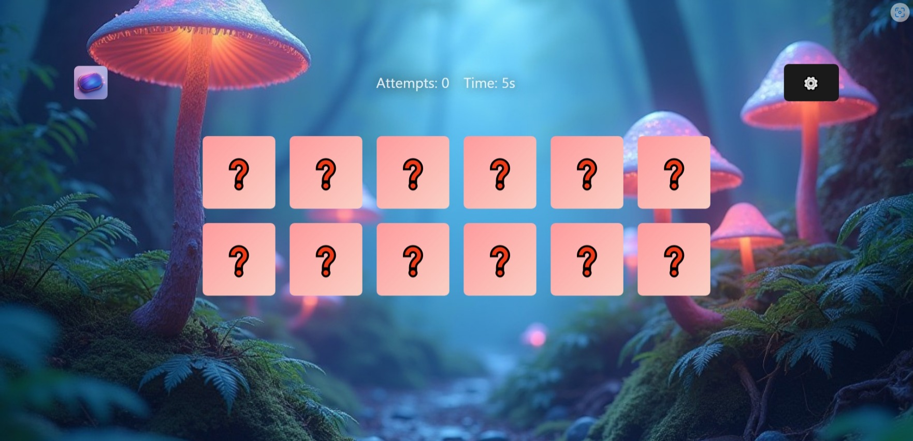
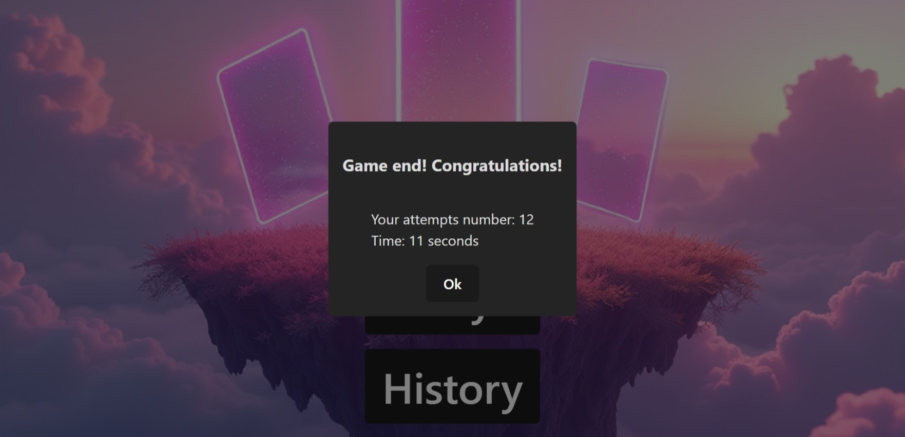
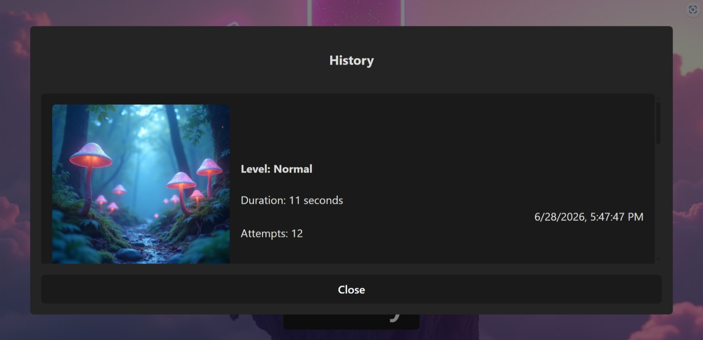

# Memory Game

A responsive memory card game built with **React**, **TypeScript**, **Vite**, **Zustand** and **SCSS**.

The app lets the player choose a difficulty level, match hidden cards, track attempts and time, and save completed game results in local history.

**Live demo:** https://memory-game-peach-xi.vercel.app/

## Preview



| Start screen                                     | Result modal                                             | History                                               |
| ------------------------------------------------ | -------------------------------------------------------- | ----------------------------------------------------- |
|  |  |  |

## Features

* Difficulty selection with different board sizes.
* Randomized card layout for every new game.
* Attempts counter and elapsed time tracking.
* Match detection and completed-pair handling.
* End-game summary modal.
* Game history saved in `localStorage`.
* Responsive UI with custom SCSS styling.

## Tech Stack

* React
* TypeScript
* Vite
* Zustand
* SCSS
* Vercel

## Implementation Details

* Zustand store manages game state, selected cards, matched pairs, timer values and saved results.
* Card data is generated dynamically based on the selected difficulty level.
* The matching flow prevents extra card selection while a pair is being checked.
* Completed results are persisted in `localStorage` and displayed in the history modal.
* The interface is split into reusable components for the menu, board, cards, settings and modals.

## Run Locally

```bash
git clone https://github.com/Stellce/memory_game.git
cd memory_game
npm install
npm run dev
```

Then open:

```text
http://localhost:5173
```

## Build

```bash
npm run build
npm run preview
```
